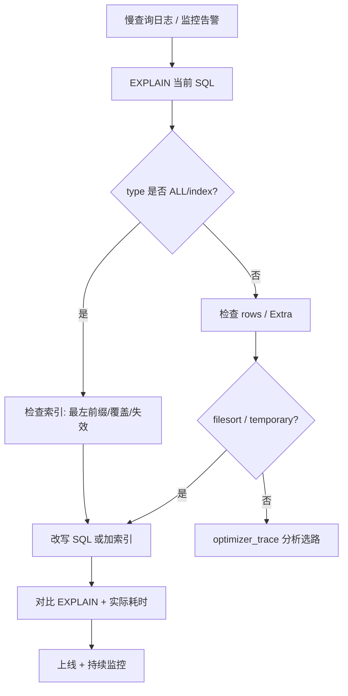

# SQL 优化

## 定义

SQL 优化是在正确性不变前提下，降低 **扫描行数、回表次数、排序/临时表开销与锁等待**，使查询/写入满足 SLA。标准路径：**慢日志定位 → EXPLAIN 分析 → 索引/SQL 改写 → 验证对比**。

## 原理

### EXPLAIN 关键列对照表

| 列 | 关注点 | 由优到劣 / 说明 |
|----|--------|-----------------|
| **type** | 访问类型 | `system` > `const` > `eq_ref` > `ref` > `range` > `index` > **ALL** |
| **key** | 实际使用索引 | NULL 表示未走期望索引 |
| **rows** | 预估扫描行数 | 越小越好，与统计信息相关 |
| **filtered** | 表条件过滤比例 | 越低说明回表/后续过滤多 |
| **Extra** | 附加信息 | 见下表 |

**Extra 常见值**

| Extra | 含义 | 行动 |
|-------|------|------|
| Using index | 覆盖索引 | 理想 |
| Using index condition | ICP | 较好 |
| Using where | 引擎/server 层过滤 | 看 rows |
| Using filesort | 额外排序 | 考虑索引序或改写 |
| Using temporary | 临时表 | 考虑索引或拆分 SQL |
| Using join buffer | Join 无索引 | 补 join 列索引 |

### 标准优化流程



### optimizer_trace 使用

```sql
SET optimizer_trace='enabled=on', end_markers_in_json=on;
-- 执行目标 SQL
SELECT * FROM information_schema.OPTIMIZER_TRACE\G
SET optimizer_trace='enabled=off';
```

用于解释 **为何未选某索引**（成本估算、回表比例、统计信息）。

### DDL 与 MDL

| 场景 | 风险 | 对策 |
|------|------|------|
| 大表 `ALTER TABLE` | MDL 排他锁阻塞 DML | Online DDL、pt-osc、gh-ost |
| 长事务 + DDL | DDL 等待 MDL，阻塞后续查询 | 杀长事务、低峰操作 |
| 大表加字段 | 5.7 部分 INPLACE；8.0 INSTANT（条件） | 查文档确认 ALGORITHM |

**Online DDL 概念**：`ALGORITHM=INPLACE` 尽量不拷贝全表；`LOCK=NONE` 允许并发 DML。仍可能有短暂 MDL。

### 写入变慢（简述）

1. 二级索引越多，每次写入维护成本越高。
2. Change Buffer 合并异步刷盘（详见 [性能优化](./性能优化.md) Phase 2）。
3. 批量写入优于单条；控制事务大小。

### B+ 查询过程（复习）

1. 从根节点二分定位页。
2. 非叶子 down 到叶子。
3. 叶子链表支持范围扫描。
4. 二级索引拿主键 → 回表聚簇索引。

结构细节链 [索引相关](./索引相关.md)、[B+Tree](../数据结构与算法/其他场景/mysql/索引结构与BPlusTree.md)。

## 应用场景

1. 慢 SQL 治理与发布前审查。
2. 报表/分页接口优化。
3. 大表 DDL 方案选型。
4. 索引设计与 EXPLAIN 验证。

## 高频面试点

1. EXPLAIN 各 type 含义？
2. 覆盖索引与索引下推？
3. 深分页如何优化？
4. MDL 是什么？DDL 为何阻塞？
5. optimizer_trace 用途？

## 面试官视角

### 考察规则

1. **流程题**：慢日志 → EXPLAIN → 改写。
2. **计划题**：读懂 type、key、Extra。
3. **DDL 题**：Online DDL、MDL、大事务。
4. **案例题**：深分页、回表、filesort。

### 典型问答

1. **`LIMIT 1000000, 10` 为什么慢？**
   - 参考回答：优化器需扫描/排序前 1000010 行再丢弃。优化：延迟关联（子查询只查 id）、游标式 `WHERE id > last_id LIMIT 10`、或搜索引擎承接深翻页。

2. **filesort 如何避免？**
   - 参考回答：ORDER BY 列与 WHERE 组成联合索引且满足最左前缀；或降低 select 列实现覆盖索引减少回表排序成本。

3. **同样 SQL 有时走索引有时不走？**
   - 参考回答：数据分布、统计信息、回表成本变化导致优化器重估；用 EXPLAIN + optimizer_trace，必要时 `ANALYZE TABLE` 或 `FORCE INDEX`（慎用）。

## 实战案例

### 案例 1：深分页

- **现象**：`SELECT * FROM orders ORDER BY id LIMIT 1000000, 10` 超时，Extra: Using filesort。
- **定位**：`EXPLAIN rows` 极大；慢日志确认扫描行数。
- **根因**：大 offset 导致大量无效扫描。
- **解法**：`SELECT * FROM orders WHERE id > ? ORDER BY id LIMIT 10`（记住上一页最大 id）；或 `INNER JOIN (SELECT id FROM orders ORDER BY id LIMIT 1000000,10) t`。

### 案例 2：回表过多

- **现象**：`SELECT * FROM user WHERE status=1` 有 `(status)` 索引仍慢。
- **定位**：`type=ref`，`Extra` 无 Using index，rows 10 万+。
- **根因**：二级索引命中后每行回表聚簇索引。
- **解法**：只查必要列；或联合索引 `(status, id, name)` 覆盖查询列。

### 案例 3：大表加字段阻塞

- **现象**：`ALTER TABLE big ADD col INT` 后全库查询卡住。
- **定位**：`SHOW PROCESSLIST` 见 Waiting for table metadata lock。
- **根因**：DDL 等长事务释放 MDL，或 DDL 本身锁表。
- **解法**：先清理长事务；使用 gh-ost/pt-osc；MySQL 8.0 评估 INSTANT ADD COLUMN。

## 一分钟速记

1. type 避免 ALL；key 不为 NULL；rows 尽量小。
2. Using index = 覆盖；ICP = 引擎层过滤。
3. filesort / temporary 优先用索引序消除。
4. 深分页用 id 游标或延迟关联，不用大 offset。
5. 优化流程：慢日志 → EXPLAIN → 改写 → 对比。
6. DDL 关注 MDL；大表用 Online DDL 或 ghost 工具。
7. optimizer_trace 看优化器为何弃索引。
8. 索引失效规则见 [索引相关](./索引相关.md)。

## 延伸问题

1. `EXPLAIN ANALYZE`（8.0.18+）与 EXPLAIN 差异？
2. join 驱动表选择与索引如何配合？

## 相关文档

- [索引相关](./索引相关.md) — 索引结构、失效、锁
- [复习案例集](./复习案例集.md)
- [性能优化](./性能优化.md) — Change Buffer、Buffer Pool（Phase 2）
