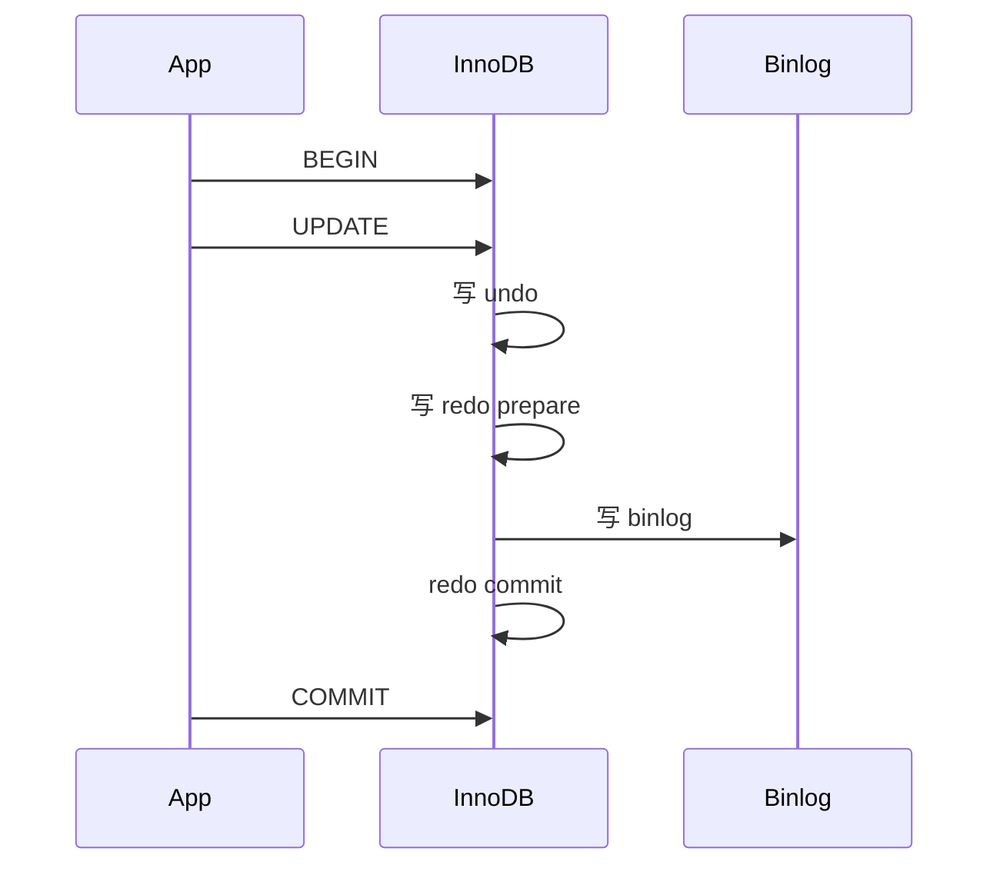

# 事务

## 定义

事务（Transaction）是一组 SQL 操作的逻辑单元，满足 **ACID** 特性。InnoDB 通过 **undo log（回滚/MVCC）**、**redo log（持久性）** 与 **锁 + MVCC（隔离）** 实现；与 Server 层 **binlog** 协作完成主从复制与崩溃恢复一致性。

## 原理

### ACID 实现机制

| 特性 | 含义 | InnoDB 实现 |
|------|------|-------------|
| **A** 原子性 | 全成功或全失败 | undo log 回滚未提交修改 |
| **C** 一致性 | 数据满足业务约束 | 应用约束 + A/I/D 共同保证 |
| **I** 隔离性 | 并发事务互不不当干扰 | MVCC + 锁（级别可配置） |
| **D** 持久性 | 提交后不因崩溃丢失 | redo log 刷盘 |

### 持久性 vs 一致性 vs CAP 一致性

| 概念 | 层次 | 含义 |
|------|------|------|
| 事务持久性 | 单机 ACID | commit 后写入 redo，崩溃可恢复 |
| 事务一致性 | 单机 ACID | 约束不被破坏（余额不为负等） |
| CAP 一致性 | 分布式 | 所有节点同一时刻看到相同数据 |

分布式环境下隔离级别需额外机制（全局时钟、分布式锁、Seata 等），见 [分区分表](./分区分表.md) Phase 2。

### 三日志在事务中的角色（概要）



详细时序与崩溃恢复见 [日志](./日志.md)。

### 代码层控制（Java / Spring）

| 手段 | 说明 |
|------|------|
| `@Transactional` | 声明式事务，AOP 代理 |
| `rollbackFor` | 默认仅 unchecked 异常回滚；checked 需显式指定 |
| `propagation` | REQUIRED / REQUIRES_NEW / NESTED 等 |
| `readOnly=true` | 只读优化，无写锁扩展 |
| 编程式 | `TransactionTemplate` |

**常见误区**：

1. **捕获异常未抛出** → Spring 认为成功 commit。
2. **同类自调用** → 绕过代理，事务不生效。
3. **事务内 RPC/慢 IO** → 长事务占连接，见 [账户缓存项目](../resume-projects/账户缓存架构优化项目.md) 误用 `@Transactional` 案例。
4. **大查询放事务内** → 锁持有久、undo 膨胀。

```java
@Transactional(rollbackFor = Exception.class)
public void transfer(...) {
    // 业务 SQL
    // 勿在事务内调用外部 HTTP 或批量慢查询
}
```

## 应用场景

1. 转账、扣库存等多步写操作。
2. 读已提交 vs 可重复读业务选型。
3. 与 binlog 配合的主从、CDC。
4. 排查连接池耗尽、锁等待。

## 高频面试点

1. ACID 分别如何实现？
2. 持久性与一致性的区别？
3. `@Transactional` 失效场景？
4. binlog、redo、undo 各干什么？
5. 长事务危害？

## 面试官视角

### 考察规则

1. **概念题**：ACID、隔离级别语义。
2. **实现题**：三日志分工、2PC 概要。
3. **代码题**：Spring 事务传播、回滚规则。
4. **排障题**：长事务、未回滚、连接池。

### 典型问答

1. **原子性如何实现？**
   - 参考回答：修改前写 undo；回滚时用 undo 还原；commit 后 undo 可 purge。

2. **持久性如何实现？**
   - 参考回答：修改页先写 redo log（WAL），按策略刷盘；崩溃后 redo 重做已 prepare/commit 的修改。

3. **为什么 `@Transactional` 有时不回滚？**
   - 参考回答：异常被 catch 未抛出；非 public 方法；自调用绕过代理；异常类型不在 rollbackFor 范围。

## 实战案例

### 案例 1：捕获异常导致事务未回滚

- **现象**：业务失败但 DB 已写入。
- **定位**：代码 `try { ... } catch (Exception e) { log }` 无 rethrow。
- **根因**：Spring 仅对抛出异常触发 rollback。
- **解法**：catch 后 rethrow 或 `TransactionAspectSupport.currentTransactionStatus().setRollbackOnly()`。

### 案例 2：长事务导致连接池耗尽

- **现象**：高峰期 `Could not get JDBC connection`。
- **定位**：连接池监控 active 持续满；慢 SQL/线程 dump 见事务未结束。
- **根因**：`@Transactional` 方法内批量外部调用或全表扫描。
- **解法**：缩小事务边界；查询移出事务；批量改异步；参考账户缓存项目拆分读写。

## 一分钟速记

1. 原子性 → undo；持久性 → redo；隔离 → MVCC+锁；一致性 → 业务+前三者。
2. 持久性是「crash-safe」；一致性含业务约束；CAP 一致性指分布式副本。
3. commit 顺序：undo → redo prepare → binlog → redo commit（2PC）。
4. `@Transactional`：异常须抛出；自调用无效；指定 rollbackFor。
5. 事务内禁止慢 RPC、大查询。
6. 长事务：占连接、扩 undo、增锁等待。
7. MVCC/幻读细节见 [主要组成与隔离级别](./主要组成与隔离级别.md) Phase 2。

## 延伸问题

1. REQUIRES_NEW 与 NESTED 区别？
2. 分布式下如何实现 ACID？（2PC、TCC、Saga）

## 相关文档

- [日志](./日志.md) — redo/binlog/undo 时序
- [索引相关](./索引相关.md) — 锁与隔离
- [复习案例集](./复习案例集.md)
- [账户缓存架构优化项目](../resume-projects/账户缓存架构优化项目.md)
