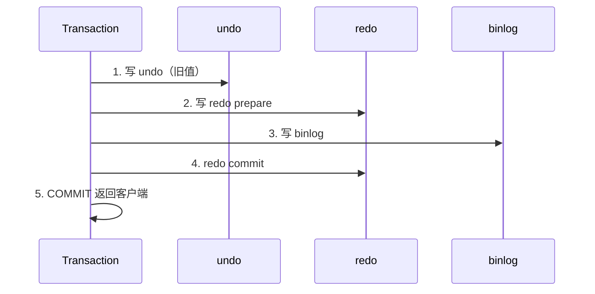

# 日志

## 定义

MySQL 日志体系分层：**InnoDB redo/undo** 保障事务持久性与回滚；**Server 层 binlog** 保障逻辑归档与主从复制。三者通过 **两阶段提交（2PC）** 保证崩溃恢复后 binlog 与 InnoDB 数据一致。

## 原理

### 三日志对比表

| 日志 | 层级 | 内容 | 主要用途 |
|------|------|------|----------|
| **redo log** | InnoDB | 物理页修改（WAL） | 崩溃恢复、持久性 |
| **undo log** | InnoDB | 旧值/回滚段 | 事务回滚、MVCC 快照 |
| **binlog** | Server | 逻辑 SQL 或行变更 | 主从复制、PITR 归档 |

### 写入时序（update 单行）

**规则**：binlog 写入成功后才 redo commit，保证 **有 binlog 必有 InnoDB 提交**（用于复制）。

### 两阶段提交（2PC）为何需要

| 若只做一步 | 崩溃后果 |
|------------|----------|
| 有 redo 无 binlog | 主库恢复有数据，从库无复制 → 不一致 |
| 有 binlog 无 redo | 从库多数据，主库恢复无 → 不一致 |

2PC 以 **binlog 为协调者**：prepare → 写 binlog → commit redo。

### binlog 三种格式

| 格式 | 内容 | 优点 | 缺点 |
|------|------|------|------|
| STATEMENT | SQL 语句 | 日志小 | 不确定函数、UDF 可能不一致 |
| ROW | 行变更 | 主从一致性好 | 体积大 |
| MIXED | 自动选择 | 折中 | 行为需理解 |

生产推荐 **ROW**（或 MIXED），避免主从数据漂移。

### 崩溃恢复流程

1. **redo**：从 checkpoint 起重做已 prepare/commit 的页修改。
2. **undo**：对未提交事务回滚。
3. 恢复完成后才接受新连接。

**断电后已 commit 数据是否在？** redo 已 commit 且刷盘策略满足（`innodb_flush_log_at_trx_commit=1` + 同步 binlog）则持久；否则可能丢最后一小段事务。

### 持久性参数（复习）

| 参数 | 含义 | 风险 |
|------|------|------|
| `innodb_flush_log_at_trx_commit=1` | 每次 commit 刷 redo | 最安全 |
| `=2` | 写 OS 缓存，每秒 fsync | 宕机可能丢 1 秒 |
| `sync_binlog=1` | 每次 commit 刷 binlog | 最安全，性能低 |

详见 [其他参数优化](./其他参数优化.md) Phase 2。

## 应用场景

1. 主从复制与读写分离。
2. 基于 binlog 的 CDC（Canal、Debezium）。
3. 误删恢复（全量备份 + binlog 重放）。
4. 崩溃恢复与数据一致性审计。

## 高频面试点

1. redo 与 binlog 区别？
2. 为什么需要两阶段提交？
3. undo 的作用？
4. binlog 格式选型？
5. 崩溃恢复步骤？

## 面试官视角

### 典型问答

1. **redo 和 binlog 区别？**
   - 参考回答：redo 是 InnoDB 物理 WAL，循环写、固定大小，用于 crash recovery；binlog 是 Server 层逻辑日志，追加写、可归档，用于复制和审计。

2. **undo 做什么？**
   - 参考回答：存修改前旧值，rollback 时还原；同时构建 Read View 可见性链，供 MVCC 快照读。

3. **主从数据不一致可能原因？**
   - 参考回答：STATEMENT 模式不确定 SQL；从库 sql_slave_skip_counter 跳过错误；半同步未开导致异步丢失；双写顺序异常（无 2PC 的老版本）。

## 实战案例

### 案例 1：主从数据不一致

- **现象**：从库少几条更新。
- **定位**：对比 `SHOW MASTER STATUS` 与从库 `relay log`；查 `binlog_format`。
- **根因**：STATEMENT 模式下 `UUID()` 等不确定函数；或复制延迟期间主库宕机丢异步 binlog。
- **解法**：改 ROW；开启半同步复制；关键业务读主或一致性读。

### 案例 2：断电后数据丢失争议

- **现象**：应用收到 commit 成功，重启后部分订单不见。
- **定位**：查 `innodb_flush_log_at_trx_commit`、`sync_binlog`；是否单机 kill -9 非 sync。
- **根因**：redo/binlog 未 fsync 即返回成功（配置为 2 或 0）。
- **解法**：金融场景 `=1` + `sync_binlog=1`；或组提交 + 半同步权衡性能。

## 一分钟速记

1. redo = 物理 WAL，崩溃重做；undo = 回滚 + MVCC。
2. binlog = 逻辑复制/归档；Server 层。
3. 顺序：undo → redo prepare → binlog → redo commit。
4. 2PC 保证 binlog 与 InnoDB 一致。
5. 生产 binlog 用 ROW；STATEMENT 有不一致风险。
6. 恢复：redo 重做 + undo 回滚未提交。
7. 持久性：`innodb_flush_log_at_trx_commit=1` + `sync_binlog=1` 最安全。

## 延伸问题

1. redo log 为什么循环写而 binlog 追加写？
2. MVCC Read View 与 undo 链关系？（见主要组成 Phase 2）

## 相关文档

- [事务](./事务.md) — ACID 与代码控制
- [高可用](./高可用.md) — 主从复制（Phase 2）
- [复习案例集](./复习案例集.md)
