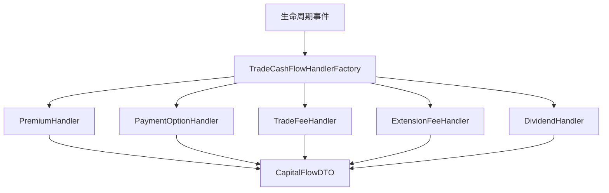

# 现金流与 Handler 模式

## 定义

生命周期事件触发后，系统需将业务动作转化为可展示的现金流记录；采用 **Factory + Handler** 模式，按事件类型与现金流类型分发到对应 Handler 处理。

## 原理 / 结构要素

### 架构



### Handler 接口

```java
public interface TradeCashFlowHandler {
    boolean supports(CashFlowViewDTO cashFlow, CapitalFlowCriteria criteria);
    void handle(CashFlowViewDTO cashFlow, CapitalFlowDTO dto,
                Map<String, String> openIdMap, Map<String, String> unwindIdMap);
}
```

- `supports()`：判断是否处理当前现金流（事件类型 + 现金流类型组合）。
- `handle()`：填充 `CapitalFlowDTO`（方向、展示名、金额、关联单据 ID）。

### Handler 列表与职责

| Handler | 支持事件 | 现金流类型 | 职责 |
|---------|----------|------------|------|
| `PremiumHandler` | OPEN | PREMIUM | 期权费方向与展示 |
| `PaymentOptionHandler` | UNWIND, SETTLE, KNOCK_OUT | PAYMENT_OPTION | 平仓/到期/敲出结算金 |
| `TradeFeeHandler` | OPEN, UNWIND, SETTLE | TRADE_FEE | 交易费（买入/卖出） |
| `ExtensionFeeHandler` | EXTENSION | EXTENSION_FEE | 展期费 |
| `DividendHandler` | DIVIDEND | DIVIDEND | 分红相关现金流 |
| `EquityIncomeHandler` | OPEN, UNWIND | EQUITY_INCOME | 权益收入（如适用） |
| `CapitalAdjustHandler` | — | CAPITAL_ADJUST | 资金调整 |
| `InterestDeductionHandler` | — | INTEREST | 利息扣除 |

> 完整 Handler 列表见 [CapitalFlowService 重构案例](../../重构案例/CapitalFlowService%20重构案例.md)。

### 事件 → Handler 路由示例

| 事件 | 现金流类型 | Handler | 方向规则 |
|------|------------|---------|----------|
| OPEN | PREMIUM | PremiumHandler | 买方 OUT |
| OPEN | TRADE_FEE | TradeFeeHandler | BUY_FEE, OUT |
| UNWIND | PAYMENT_OPTION | PaymentOptionHandler | 依 NPV 正负 |
| UNWIND | TRADE_FEE | TradeFeeHandler | SELL_FEE, IN |
| SETTLE | PAYMENT_OPTION | PaymentOptionHandler | 依 Payoff |
| EXTENSION | EXTENSION_FEE | ExtensionFeeHandler | 依约定 |

## 业务规则

1. 每条现金流必须关联 `contractId`、`eventId`、`cashFlowType`。
2. 方向（IN/OUT）依**簿记视角**（客户 vs 券商）统一，全链路一致。
3. 同一事件可产生多条现金流（如 OPEN 同时产生 Premium + TradeFee）。
4. 金额为正数，方向由 `PaymentDirectionEnum` 表达。
5. Handler 不匹配时记录 WARN，不抛异常（避免阻塞批处理）。

## 工程实现要点

### Factory 查找

```java
@Component
@RequiredArgsConstructor
public class TradeCashFlowHandlerFactory {
    private final List<TradeCashFlowHandler> handlers;

    public Optional<TradeCashFlowHandler> getHandler(
            CashFlowViewDTO cashFlow, CapitalFlowCriteria criteria) {
        return handlers.stream()
                .filter(h -> h.supports(cashFlow, criteria))
                .findFirst();
    }
}
```

Spring 自动注入所有 `@Component` Handler，新增类型只需新增类，符合开闭原则。

### 重构收益

| 指标 | 重构前 | 重构后 |
|------|--------|--------|
| 主方法行数 | ~100 行 | ~30 行 |
| Handler 数量 | 0 | 8 个 |
| 可测试性 | 低 | 高（单测 Handler） |

详见 [Factory + Handler 模式落地实践](../../模式落地实践/factory-handler-pattern.md) 与 [CapitalFlowService 重构案例](../../重构案例/CapitalFlowService%20重构案例.md)。

### 扩展新 Handler 步骤

1. 新建类继承 `AbstractTradeCashFlowHandler`。
2. 实现 `supports()` 和 `handle()`。
3. 加 `@Component`，Spring 自动注册。
4. 编写单元测试。

## 高频面试点

1. 为什么用 Factory + Handler 而不是 if-else。
2. PremiumHandler 与 PaymentOptionHandler 的职责边界。
3. 如何扩展新的现金流类型（开闭原则）。
4. OPEN 事件产生几条现金流、分别由谁处理。
5. supports() 匹配不到时如何处理。
6. 部分平仓时 PaymentOptionHandler 如何缩放金额。

## 待补充项

- 项目中 `CashFlowType` 枚举完整列表。
- `AbstractTradeCashFlowHandler` 提供的公共方法。
