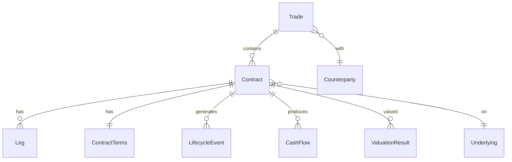

# 领域模型与合约结构

## 定义

领域模型描述场外期权业务的核心实体及其关系，是生命周期事件、现金流与估值的数据基础。

## 原理 / 结构要素

### 核心实体



### 实体说明

| 实体 | 职责 |
|------|------|
| `Trade` | 交易意图，含对手方、交易员、录入时间 |
| `Contract` | 生效合约，含状态、名义本金、起止日期 |
| `Leg` | 多腿结构的单腿，含方向、行权价、数量 |
| `ContractTerms` | 产品结构要素，JSON 或强类型，版本化 |
| `LifecycleEvent` | 生命周期事件记录 |
| `CashFlow` | 现金流记录 |
| `ValuationResult` | 估值结果快照 |

### ContractTerms 版本化

```
ContractTerms v1 (OPEN)  → readOnly
ContractTerms v2 (EXTENSION) → readOnly
ContractTerms v3 (current) → active
```

每次 EXTENSION / CORP_ACTION 产生新版本，事件 Payload 引用 `termsVersion`。

## 业务规则

1. 一个 Trade 可包含一个或多个 Contract（分批建仓场景）。
2. Contract 状态变更必须通过 LifecycleEvent 驱动，不可直接 UPDATE status。
3. Terms 变更必须产生新版本，旧版本不可修改。
4. 剩余名义本金 `remainingNotional` ≤ 初始名义本金 `initialNotional`。
5. 确认书编号、合约 ID、交易 ID 三者关联可追溯。

## 工程实现要点

- `ContractTerms` 按 `ProductType` 使用不同 Schema（Strategy 模式）。
- 校验：`TermsValidatorRegistry.get(productType).validate(terms)`。
- 观察日预生成：OPEN 时调用 `ObservationDateGenerator.generate(terms)` 写入 DB。
- Event Sourcing 可选：Contract 当前状态 = fold(所有 LifecycleEvent)。
- 索引：`contractId + status`、`observationDate + productType`（批处理查询优化）。

## 高频面试点

1. Trade、Contract、Leg 三者的关系。
2. 为什么 Terms 需要版本化。
3. 剩余名义本金在部分平仓后如何更新。
4. 如何用 Event Sourcing 重建合约状态。
5. 不同 ProductType 的 Terms 如何扩展（开闭原则）。

## 待补充项

- 项目中实体类包路径与表结构。
- Terms JSON Schema 示例（Snowball）。
