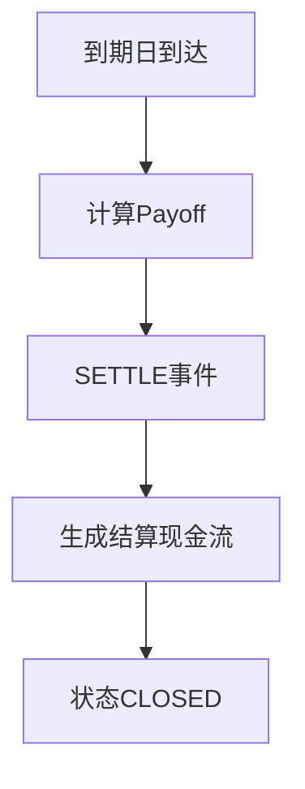

# 到期结算

## 定义

到期结算（Settlement）是合约到达到期日后，根据 Payoff 公式计算最终结算金额、完成资金交割并关闭合约的过程。

## 原理 / 结构要素

### 结算流程

### 不同产品到期 Payoff

| 产品 | 到期 Payoff |
|------|-------------|
| 香草 Call | max(S_T - K, 0) × Notional / S₀ |
| 香草 Put | max(K - S_T, 0) × Notional / S₀ |
| 雪球（未敲入） | 100% 本金 + 累计票息 |
| 雪球（已敲入） | 依条款，通常承担下跌损失 |
| 障碍（已敲出） | 已在敲出时结算，到期无操作 |
| Autocall（未敲出） | 100% 本金 + 约定 Coupon |

### 事件类型

| 事件 | 说明 |
|------|------|
| `EXPIRE` | 到期日标记，状态 → EXPIRED |
| `SETTLE` | 计算 Payoff，生成结算现金流 |
| 终态 | `CLOSED` |

## 业务规则

1. 到期日 = 最后观察日（或条款约定的结算日 T+2）。
2. 已 KNOCKED_OUT 的合约在敲出日已结算，到期日跳过。
3. 已 UNWOUND 的合约在平仓日已结算，到期日跳过。
4. Payoff = 0 时仍触发 SETTLE，但无结算现金流（ABANDON 路径）。
5. 结算金额 = Payoff × 剩余名义本金 / 初始名义本金（部分平仓后）。
6. SETTLE 后状态：EXPIRED → SETTLED → CLOSED，不可逆。

## 工程实现要点

- Job：`SettlementBatchJob`，到期日次日运行（等待最终 Spot）。
- 输入：`contractId`、`expiryDate`、`finalSpot`。
- Payoff 计算：`PayoffCalculator` 按 `ProductType` 策略分发。
- 现金流：`PaymentOptionHandler` 处理 SETTLE 事件的结算金。
- 幂等键：`contractId + SETTLE + expiryDate`。
- 结算完成后释放保证金占用。
- 生成结算确认书，关联 `settlementDocumentId`。

## 高频面试点

1. SETTLE 与 EXPIRE 的区别。
2. 雪球已敲入到期的 Payoff 如何计算。
3. 已敲出合约到期日批处理如何处理（跳过）。
4. 部分平仓后到期结算如何缩放。
5. Payoff = 0 时是否仍产生 SETTLE 事件。
6. 结算日与到期日的关系（T+0 vs T+2）。

## 待补充项

- 项目中 SettlementBatchJob 与 ObservationBatchJob 的执行顺序。
- 到期 Payoff 计算器的 ProductType 策略列表。
