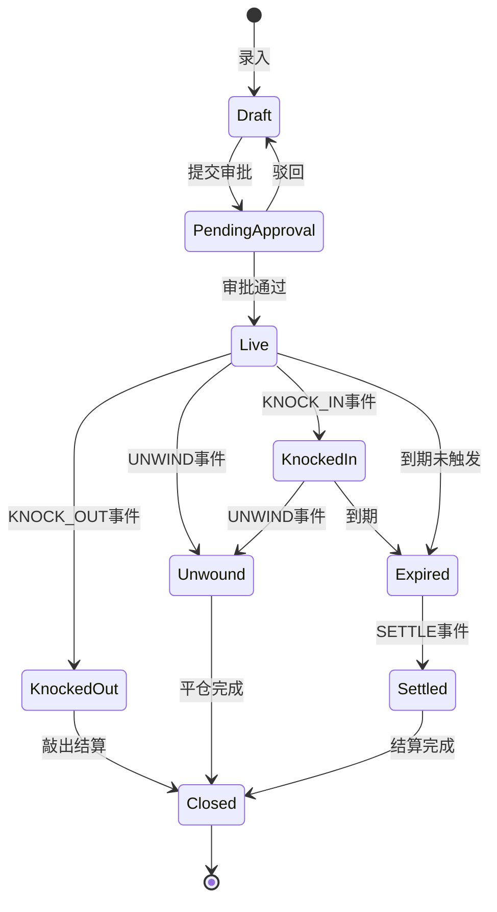
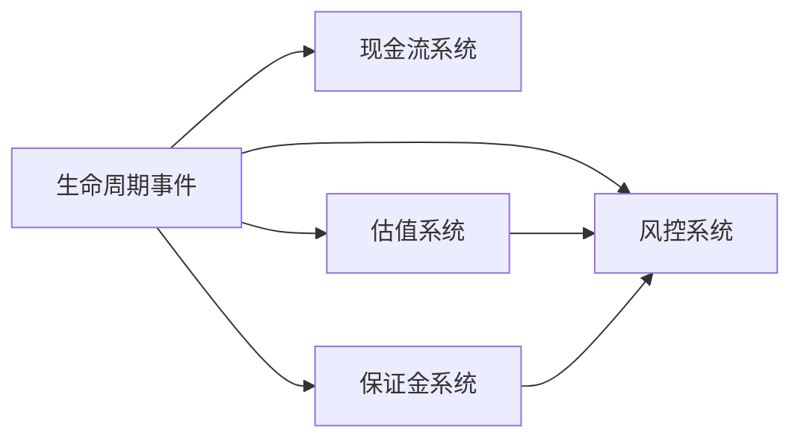

# 生命周期总览

## 定义

场外期权生命周期指合约从簿记创建到最终关闭的全过程，由**状态机**与**生命周期事件**驱动，联动现金流、估值与风控。

## 原理 / 结构要素

### 状态机全景

### 核心状态枚举

| 状态 | 含义 |
|------|------|
| `DRAFT` | 草稿，未提交 |
| `PENDING_APPROVAL` | 待审批 |
| `LIVE` | 生效，参与观察与估值 |
| `KNOCKED_IN` | 已敲入 |
| `KNOCKED_OUT` | 已敲出 |
| `UNWOUND` | 已平仓 |
| `EXPIRED` | 已到期，待结算 |
| `SETTLED` | 已结算 |
| `CLOSED` | 已关闭，终态 |

### 事件驱动 vs 批处理

| 类型 | 触发方式 | 典型事件 |
|------|----------|----------|
| 实时事件 | 用户操作 / API 调用 | OPEN, UNWIND, EXTENSION |
| 批处理事件 | 日终 / 观察日 Job | OBSERVE, KNOCK_IN, KNOCK_OUT, COUPON, SETTLE |

### 与相邻系统的联动

## 业务规则

1. 状态迁移必须遵循状态机定义，**非法迁移拒绝并记录**。
2. `CLOSED` 为终态，不可再产生任何事件。
3. 批处理事件必须在**市场数据就绪后**执行（收盘价发布后）。
4. 同一合约同一观察日**不可重复**触发 KNOCK_IN / KNOCK_OUT。
5. 事件处理顺序：状态变更 → 现金流生成 → 估值重算 → 风控更新。
6. 事件失败时整体回滚，保证合约状态与现金流一致。

## 工程实现要点

- 状态机实现参考 [State + Machine 模式落地实践](../../模式落地实践/State%20+%20Machine或Engine%20模式落地实践.md)。
- `ContractStateMachine.transition(contract, event)` 统一入口。
- 批处理 Job：`ObservationBatchJob`、`SettlementBatchJob`，按观察日/到期日驱动。
- 事件表 `LifecycleEvent`：`eventId`、`contractId`、`eventType`、`eventDate`、`payload`、`status`。
- 幂等键：`contractId + eventType + eventDate`，防止重复处理。
- 详见 [生命周期事件设计](../实现/生命周期事件设计.md)、[状态机与流程编排](../实现/状态机与流程编排.md)。

## 高频面试点

1. 画出雪球合约从开仓到关闭的完整状态流转。
2. 哪些事件是实时的，哪些是批处理的。
3. 敲入/敲出事件为何不直接产生现金流。
4. 生命周期事件与估值批次的时序关系。
5. 如何保证观察日批处理的幂等性。
6. 平仓后合约还能否触发敲入。

## 待补充项

- 个人项目中完整的 `ContractStatus` 枚举与迁移矩阵。
- 审批流嵌入状态机的具体节点。
