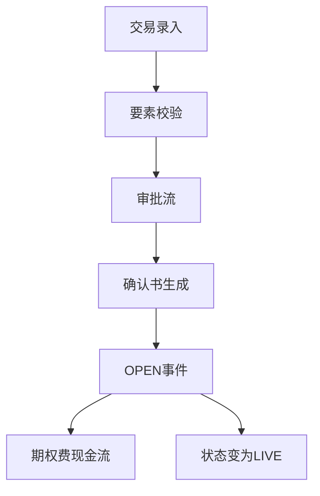

# 簿记与开仓

## 定义

簿记（Booking）是将场外期权交易录入系统并使其生效的过程；开仓（OPEN）是合约进入 `LIVE` 状态、开始参与观察与估值的起始事件。

## 原理 / 结构要素

### 开仓流程

### 录入要素（必填）

- 交易对手、标的、产品类型、名义本金、起息日、到期日
- 结构要素（依产品类型）：行权价、障碍价、观察日列表、票息率等
- 买卖方向、期权费、结算货币

## 业务规则

1. 起息日 ≤ 到期日；名义本金 > 0。
2. 观察日列表必须在 [起息日, 到期日] 内，有序且无重复。
3. 审批通过后方可触发 OPEN；驳回回到 DRAFT。
4. OPEN 当日生成期权费现金流（Premium），方向依买卖约定。
5. 确认书编号与合约 ID 一一对应，不可重复。
6. 同一交易对手同一标的同一日起息日的重复录入需人工确认（防重）。

## 工程实现要点

- API：`POST /trades` → 校验 → 写 `Trade` + `Contract` + `Terms`。
- 审批：工作流引擎驱动 `DRAFT` → `PENDING_APPROVAL` → `LIVE`。
- OPEN 事件：`EventType.OPEN`，Payload 含 `tradeId`、`premiumAmount`、`paymentDate`。
- 现金流：`PremiumHandler` 处理 OPEN 事件下的期权费（见 [现金流与 Handler 模式](../实现/现金流与Handler模式.md)）。
- 确认书：模板引擎生成 PDF，存储 `confirmationDocumentId`。
- 幂等：同一 `tradeId` 不可重复 OPEN。

## 高频面试点

1. 簿记与开仓的区别（录入 vs 生效事件）。
2. OPEN 事件产生哪些下游动作（现金流、状态、估值）。
3. 如何防止重复开仓。
4. 确认书与系统数据不一致时的处理流程。
5. 多腿结构的簿记是一次录入还是逐腿录入。

## 待补充项

- 项目中审批流的节点与角色配置。
- 确认书模板与 Terms 字段的映射关系。
