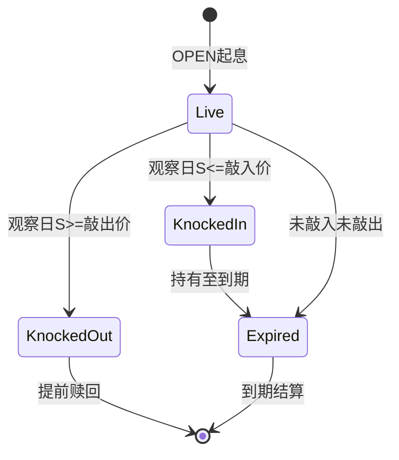

# 雪球与自动赎回

## 定义

雪球（Snowball）是国内 OTC 市场最主流的结构化产品之一：未敲入时按票息观察日获得固定票息；若敲入则承担标的下跌风险；敲出时提前终止并返还本金加票息。凤凰（Phoenix）与自动赎回（Autocall）为变体。

## 原理 / 结构要素

### 雪球核心机制

| 要素 | 典型值 | 说明 |
|------|--------|------|
| 初始价格 S₀ | 起息日收盘价 | 所有百分比条款基准 |
| 敲入价 B_in | 70% ~ 85% × S₀ | Down-and-In |
| 敲出价 B_out | 100% ~ 103% × S₀ | Up-and-Out，可选 |
| 票息观察日 | 每月/每季 | 未敲入时支付票息 |
| 票息率 | 年化 12% ~ 20% | × 持有天数 / 365 |
| 敲入保护 | 有/无 | 保护期内不判定敲入 |
| 到期 Payoff（已敲入） | max(S_T - K, 0) 或 本金 + min(0, S_T/S₀ - 1) | 条款定制 |

### 三种结局

1. **敲出（Knock-Out）**：观察日 S ≥ B_out → 提前终止，返还 100% 本金 + 累计票息 + 红利（如有）。
2. **未敲入持有至到期**：返还 100% 本金 + 全部票息。
3. **敲入后持有至到期**：按条款承担下跌损失，可能亏损超过票息收益。

### 凤凰（Phoenix）

- 票息为**条件票息**：仅在观察日未敲入且满足其他条件时支付。
- 已敲入后通常**停止票息**支付。
- 部分凤凰在敲入后仍按降低后的票息继续支付。

### 自动赎回（Autocall）

- 无敲入风险，仅有敲出机制。
- 每个观察日若 S ≥ B_out，提前赎回：本金 + Coupon。
- 若从未敲出，到期按约定 Payoff 结算（可能为 100% 本金或参与上涨）。

### 国内 OTC 主流变体

| 变体 | 特征 |
|------|------|
| 经典雪球 | 有敲入 + 有敲出 + 固定票息 |
| 保本雪球 | 敲入后仍 100% 本金保护（实为降低票息换保护） |
| 阶梯雪球 | 敲出价随观察日逐步降低 |
| 增强型雪球 | 敲出时额外红利；或上涨参与率 > 100% |
| 凤凰 | 条件票息，敲入后停息 |

## 业务规则

1. **敲入判定**：观察日收盘价 S ≤ B_in（Down-and-In，以条款为准）。
2. **敲出判定**：观察日收盘价 S ≥ B_out（Up-and-Out）；敲出后合约立即终止。
3. **敲入保护期**：保护期内（如前 3 个月）不判定敲入。
4. **票息支付**：仅在未敲入状态 + 票息观察日触发；已敲入后是否继续付息依条款。
5. **敲出与敲入同日**：以条款优先级为准（常见：敲出优先于敲入）。
6. **已敲出合约**不可再敲入；状态变为 `KNOCKED_OUT` → `CLOSED`。
7. **已敲入合约**持有至到期，到期 Payoff 按敲入后公式计算。

## 工程实现要点

- `ProductType.SNOWBALL` / `PHOENIX` / `AUTOCALL` 对应不同 Terms Schema。
- 观察日批处理顺序：**先判敲出 → 再判敲入 → 再判票息**（顺序必须固定，写入代码常量）。
- 状态机：`LIVE` → `KNOCKED_IN` / `KNOCKED_OUT` / `EXPIRED` → `CLOSED`。
- 事件：`KNOCK_IN`、`KNOCK_OUT`、`COUPON`、`AUTOCALL`、`SETTLE`。
- 敲出时生成 `PaymentOptionHandler` 处理的结算现金流（本金 + 票息）。
- 票息现金流由 `CouponHandler` 或 `PremiumHandler` 变体处理。
- 敲入/敲出不直接产生现金流，触发**状态变更 + 估值重算**。
- 估值：路径依赖，使用蒙特卡洛；敲入后 Payoff 变为一维香草形态，可切换定价模型。

## 高频面试点

1. 用 30 秒描述雪球的三条可能路径（敲出 / 未敲入到期 / 敲入到期）。
2. 敲入与敲出的触发条件与业务后果。
3. 为什么雪球对卖方是 Short Vega + Short Gamma（接近敲入/敲出时）。
4. 凤凰与雪球的票息差异。
5. Autocall 与雪球的风险对比（Autocall 无敲入风险）。
6. 敲出与敲入同日的处理规则。
7. 敲入后估值模型为何要切换。
8. 雪球名义本金 100 万、敲入价 80%、到期标的价格 70%，如何计算客户损失（按条款）。

## 待补充项

- 个人项目中雪球 `ProductType` 枚举与 Terms 字段完整列表。
- 票息计算公式（ACT/365 vs ACT/360）在项目中的约定。
