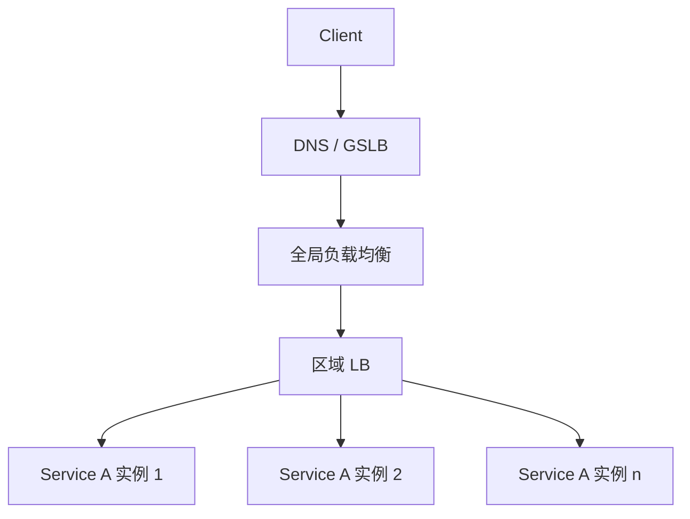
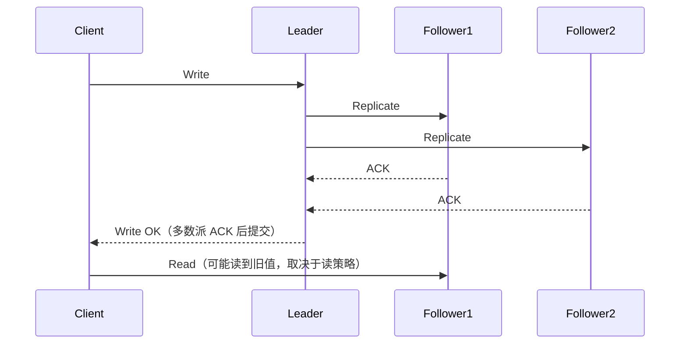
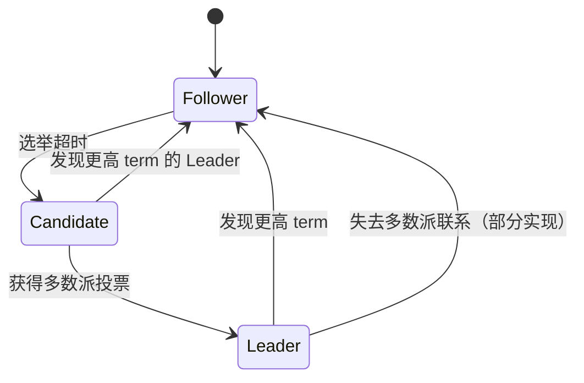
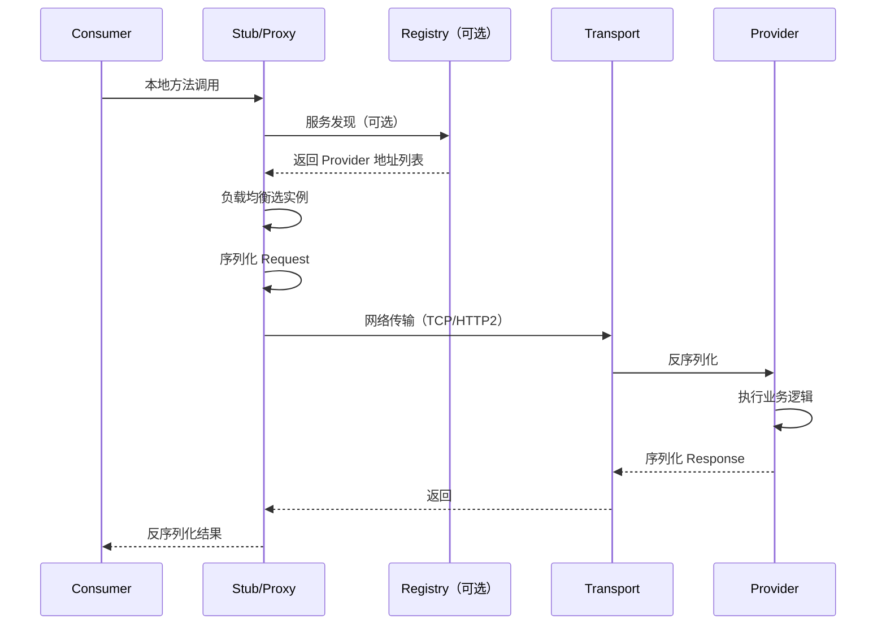
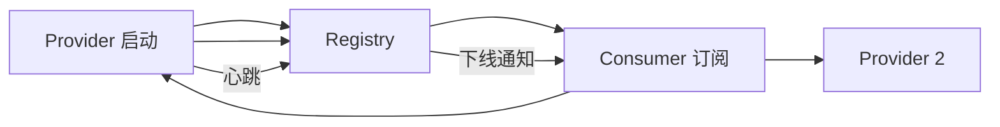

# 常见计算机设计

## 知识点清单

- 负载均衡算法
- 分布式系统一致性
- 选举算法（Raft / Paxos / ZAB）
- RPC 框架设计
- 服务注册与发现

---

## 定义

常见计算机设计指分布式系统中反复出现的 **基础架构模式与协议**：如何在多节点间分配流量、达成一致、选出 Leader、远程调用和动态发现服务。它们是系统设计面试与工程落地的公共 vocabulary。

| 主题 | 解决的核心问题 |
|------|----------------|
| 负载均衡 | 请求如何分发到多个后端，使吞吐最大、延迟最小、节点利用率均衡 |
| 一致性 | 多副本读写时，客户端看到什么语义的数据 |
| 选举算法 | 分布式环境下如何选出唯一 Leader 并处理故障切换 |
| RPC | 跨进程/跨机器如何像本地调用一样发起远程方法调用 |
| 服务注册与发现 | 服务实例动态上下线时，调用方如何找到可用地址 |

## 原理

### 1. 负载均衡算法

#### 常见算法对比

| 算法 | 原理 | 优点 | 缺点 | 典型场景 |
|------|------|------|------|----------|
| 轮询（RR） | 按顺序依次分发 | 实现简单 | 不考虑节点差异 | 同构、短连接 |
| 加权轮询（WRR） | 按权重比例轮询 | 适配异构机器 | 权重需人工维护 | CPU/内存不同的节点 |
| 随机（Random） | 随机选节点 | 实现简单 | 短期可能不均 | 无状态网关 |
| 加权随机 | 按权重随机 | 实现简单 | 短期波动大 | 轻量网关 |
| 最小连接（LC） | 选当前连接数最少节点 | 适配长连接 | 需维护连接计数 | WebSocket、gRPC 长连接 |
| 加权最小连接 | 连接数 / 权重 | 兼顾异构与长连接 | 实现复杂 | 混合负载 |
| 一致性 Hash | 对 key 做 hash 映射到环 | 扩缩容只影响相邻节点 | 可能数据倾斜 | 有状态缓存、Session 亲和 |
| 源地址 Hash | 对客户端 IP hash | 同一客户端固定到同一节点 | 节点变化时迁移大 | Session 粘滞 |
| 最短响应时间 | 选 RTT/响应时间最短节点 | 动态感知性能 | 需探测与统计 | 7 层 LB、Service Mesh |

#### 一致性 Hash 流程

工程规则：

1. 引入 **虚拟节点**（如 150~200 个/物理节点）缓解数据倾斜。
2. 扩缩容时仅相邻区间迁移，适合缓存分片；无状态 HTTP 服务通常用 RR/WRR 即可。
3. 四层 LB（LVS/F5）看连接与 IP；七层 LB（Nginx/Envoy）可看 URL、Header、Cookie。

#### 负载均衡在架构中的位置

### 2. 分布式系统一致性

#### CAP 与 PACELC

| 定理 | 含义 | 工程结论 |
|------|------|----------|
| CAP | 分区发生时，Consistency 与 Availability 不可兼得 | 网络分区必须做选择 |
| CP 系统 | 分区时牺牲可用性，保证一致 | ZooKeeper、etcd、HBase |
| AP 系统 | 分区时牺牲强一致，保证可用 | Eureka、Cassandra、Dynamo |
| PACELC | 无分区时在 Latency 与 Consistency 间取舍 | 多数互联网系统偏 AP + 最终一致 |

#### 一致性级别（由强到弱）

| 级别 | 语义 | 示例 |
|------|------|------|
| 线性一致性（Linearizable） | 所有操作有全局顺序，读总能看到最新写 | etcd 强读、ZooKeeper 同步读 |
| 顺序一致性 | 各进程看到相同操作顺序，但不要求与实时一致 | 部分分布式队列 |
| 因果一致性 | 有因果关系的操作顺序一致 | 向量时钟场景 |
| 最终一致性 | 无新写入后，Eventually 所有副本一致 | DNS、Redis 主从异步复制、Cassandra |

#### 复制与读写模型

读写策略规则：

1. **强一致读**：读 Leader 或 Read Index / Lease Read（Raft）。
2. **最终一致读**：读 Follower，延迟低但可能 stale。
3. **Quorum 读写**：R + W > N 时可保证读到最新写（如 N=3, W=2, R=2）。

### 3. 选举算法（Raft / Paxos / ZAB）

#### 协议对比

| 维度 | Paxos | Raft | ZAB |
|------|-------|------|-----|
| 目标 | 达成共识（value） | 复制日志 + 选 Leader | ZK 原子广播 + 崩溃恢复 |
| 理解难度 | 高 | 低（为可理解性设计） | 中 |
| Leader | Multi-Paxos 需 Leader | 强依赖 Leader | 强依赖 Leader |
| 日志 | 可有空洞 | 连续日志、不允许空洞 | 事务 ID（zxid）递增 |
| 典型应用 | Chubby、早期 GStore | etcd、Consul、TiKV | ZooKeeper |
| 工程采用 | 理论经典，直接实现少 | 工业界主流 | ZK 内置 |

#### Raft 核心流程

**Leader 选举**：

**日志复制**（简化规则）：

1. Client 写请求只发 Leader。
2. Leader 追加本地日志，并行复制到 Follower。
3. 多数派持久化成功后 **commit**，再 apply 到状态机。
4. Follower 日志冲突时按 Leader 覆盖（term + index 对齐）。

**任期（term）规则**：

1. 每个 term 最多一个 Leader。
2. 投票按 term 优先，先到先得多数派者当选。
3. 旧 Leader 网络隔离时无法提交新日志（需多数派 ACK）。

#### Paxos 与 ZAB 一句话

- **Paxos**：Proposer 提出 value，Acceptor 多数派接受即选定；Multi-Paxos 追加日志解决连续提交。
- **ZAB**：Leader 广播 Proposal，Follower ACK 后 Commit；崩溃恢复阶段同步 zxid 保证顺序。

### 4. RPC 框架设计

RPC（Remote Procedure Call）把远程调用封装为本地方法调用语义。

#### RPC 一次调用流程

#### RPC 核心模块

| 模块 | 职责 | 工程取舍 |
|------|------|----------|
| 序列化 | 对象 ↔ 字节流 | Protobuf（紧凑、跨语言）/ Hessian / JSON（可读、体积大） |
| 协议 | 帧格式、魔数、版本 | 自定义二进制 / gRPC（HTTP2 + Protobuf） |
| 网络 | 连接管理、多路复用 | Netty + TCP；gRPC 用 HTTP2 流 |
| 服务治理 | 发现、路由、限流 | 集成注册中心或 Service Mesh |
| 可靠性 | 超时、重试、熔断 | 仅幂等读可重试；写需幂等键 |
| 上下文 | TraceId、Metadata | OpenTelemetry 透传 |

#### 超时、重试、熔断规则

1. **超时**：连接超时 + 请求超时分层设置；下游慢不能拖垮上游线程池。
2. **重试**：仅对幂等操作、网络超时、明确可重试错误码；指数退避 + 抖动；限制最大重试次数。
3. **熔断**：错误率/慢调用超阈值打开熔断，快速失败；半开探测恢复。
4. **隔离**：Bulkhead 线程池隔离，防止单下游占满资源。

代表框架：gRPC、Dubbo、Thrift、brpc。

### 5. 服务注册与发现

#### 核心模型

#### 主流方案对比

| 组件 | 一致性模型 | 健康检查 | 配置中心 | 典型栈 |
|------|------------|----------|----------|--------|
| ZooKeeper | CP（ZAB） | 临时节点会话 | 弱 | Dubbo + ZK |
| etcd | CP（Raft） | Lease | 支持 | K8s、CoreDNS |
| Consul | CP（Raft） | 多种 check | 支持 | 云原生 |
| Eureka | AP | 客户端心跳 | 否 | Spring Cloud Netflix |
| Nacos | AP/CP 可切换 | 心跳 + TCP | 强 | Spring Cloud Alibaba |
| K8s Service | etcd 后端 | kubelet 探针 | 否 | 容器编排内置 |

#### 注册发现流程规则

1. **注册**：Provider 启动时写入 `serviceName → ip:port + metadata`。
2. **心跳**：定期续约；超时未心跳则标记不可用并推送变更。
3. **发现**：Consumer 本地缓存实例列表 + 订阅变更（push 或 long polling）。
4. **负载均衡**：Consumer 侧 Client LB（Dubbo）或 Data Plane LB（Envoy/Istio）。

#### CP vs AP 选型

| 场景 | 选型 | 原因 |
|------|------|------|
| 配置、分布式锁、选主 | CP（ZK/etcd） | 不能读到错误 Leader 或脏配置 |
| 微服务实例列表 | AP（Eureka/Nacos AP） | 分区时宁可返回旧列表也要可用 |
| K8s 集群 | etcd | 与容器编排强一致绑定 |

## 应用场景

| 场景 | 涉及设计 | 典型方案 |
|------|----------|----------|
| 网关流量入口 | 负载均衡 | Nginx RR + 健康检查；API 网关加权路由 |
| 缓存集群扩缩容 | 一致性 Hash | Redis Cluster slot；Memcached 一致性 Hash |
| 分布式配置 | CP 一致性 | etcd / Nacos 配置推送 |
| 订单 / 库存写 | 强一致或可靠队列 | Raft 存储 + 幂等；或 DB 事务 + 消息最终一致 |
| 微服务互调 | RPC + 注册发现 | Dubbo/gRPC + Nacos |
| K8s 控制面 | 选举 + 一致存储 | etcd Raft 选 Leader |
| 消息队列 | 顺序 + 副本 | Kafka ISR + Leader 选举 |

## 高频面试点

1. **负载均衡**：RR、WRR、一致性 Hash 原理；虚拟节点；四层 vs 七层。
2. **CAP / 一致性级别**：强一致、最终一致；Quorum 读写公式 R + W > N。
3. **Raft**：选举、日志复制、commit 条件、脑裂时旧 Leader 为何不能写入。
4. **Paxos / Raft / ZAB 对比**：理解难度、Leader、典型产品。
5. **RPC**：序列化选型、超时重试熔断、幂等性。
6. **注册发现**：CP vs AP；心跳与下线；Consumer 缓存与变更推送。

## 可观测性指标

| 层级 | 指标 | 告警阈值思路 |
|------|------|--------------|
| 负载均衡 | QPS、P99 延迟、5xx 率、后端健康数、连接数 | 5xx > 1%；健康节点 < 50% |
| RPC | 调用量、成功率、超时率、重试次数、熔断状态 | 超时率 > 5%；熔断 OPEN |
| 注册中心 | 注册实例数、心跳失败率、推送延迟 | 实例骤降 > 30% |
| 一致性存储 | Leader 变更次数、commit 延迟、Follower 落后量 | 频繁选主；replication lag 持续增大 |
| 分布式链路 | Trace 采样、跨服务 RT | 单跳 P99 突增 |

日志与追踪规则：

1. 全链路 **TraceId** 从网关透传到 RPC Metadata。
2. RPC 超时日志必须包含：service、method、peer、耗时、重试次数。
3. Leader 切换必须审计日志，关联业务写入失败窗口。

## 面试官视角：常见计算机设计考题

### 考察规则

1. **概念题**考察定义边界，要求候选人能区分 LB 算法、一致性级别、CP/AP。
2. **原理题**考察流程，要求候选人能描述 Raft 选举、RPC 调用链、注册发现心跳。
3. **对比题**考察协议与组件选型，要求候选人能对比 Paxos/Raft/ZAB、Eureka/Nacos/etcd。
4. **设计题**考察工程取舍，要求候选人能结合 QPS、延迟、一致性需求给方案。
5. **排障题**考察可观测性，要求候选人能根据指标定位 LB 倾斜、RPC 超时、脑裂。

### 负载均衡题

1. **一致性 Hash 如何解决扩缩容时的缓存失效问题？**
   - 考察点：Hash 环、虚拟节点、仅相邻区间迁移。
   - 追问方向：100 个物理节点需要多少虚拟节点？
   - 参考回答：普通 hash 在节点数变化时几乎所有 key 重新映射。一致性 Hash 将节点与 key 映射到环上，扩容只影响相邻一段 key。虚拟节点让各物理节点在环上分布更均匀，减少倾斜。经验上每物理节点 100~200 个虚拟节点，具体看倾斜监控。

2. **四层负载均衡和七层负载均衡的区别？**
   - 考察点：OSI 层级、能力边界、性能。
   - 参考回答：四层基于 IP+端口转发，不解析 HTTP，性能高，无法按 URL 路由。七层解析 HTTP/gRPC 等应用协议，可按路径、Header、Cookie 路由，可做 TLS 终结、限流、鉴权，延迟与 CPU 开销更高。

### 一致性题

1. **什么是最终一致性？哪些业务可以接受？**
   - 考察点：一致性谱系与业务容忍度。
   - 参考回答：最终一致性指写入成功后，不保证立即可读最新值，但无新写入时 replicas 最终收敛。可接受场景：社交点赞数、评论列表、搜索索引、DNS、非关键统计。不可接受场景：账户余额扣款、库存扣减（需强一致或可靠事务 + 幂等补偿）。

2. **Quorum 机制 R + W > N 保证什么？**
   - 考察点：读写交集必含最新 committed 数据。
   - 参考回答：N 为副本数，W 为写 ACK 数，R 为读参与数。当 R + W > N 时，读集合与写集合必有交集，交集副本含最新 committed 值。例 N=3, W=2, R=2：可容忍 1 节点故障且读到最新写。

### 选举算法题

1. **Raft 中 Leader 选举过程？**
   - 考察点：term、随机超时、多数派投票、日志新旧比较。
   - 参考回答：Follower 选举超时未收到心跳则变 Candidate，term+1 自投并拉票。获多数派投票则成 Leader，向 Follower 发心跳。投票规则：同一 term 每节点一票；Candidate 日志至少与自己一样新才投票。更高 term 的 Leader 出现则当前节点退为 Follower。

2. **Raft 与 Paxos 的区别？为什么 etcd 选 Raft？**
   - 考察点：可理解性、工程实现、连续日志。
   - 参考回答：Paxos 理论完备但难理解与实现，Multi-Paxos 需额外工程化。Raft 将问题分解为选举、日志复制、安全性，日志连续无空洞，易于实现与调试。etcd 需要可靠复制日志与清晰 Leader 语义，故选 Raft。

3. **ZAB 和 Raft 有什么相似点？**
   - 考察点：Leader 主导、多数派、崩溃恢复。
   - 参考回答：均有强 Leader、多数派 ACK 后提交、崩溃恢复时同步日志/zxid。ZAB 为 ZK 定制，含广播与恢复两阶段；Raft 更通用。ZK 选主与配置变更依赖 ZAB 顺序保证。

### RPC 题

1. **设计 RPC 框架需要考虑哪些模块？**
   - 考察点：序列化、协议、网络、治理、可靠性。
   - 参考回答：① IDL/接口定义；② 序列化（Protobuf 等）；③ 帧协议；④ 传输（Netty/HTTP2）；⑤ 服务发现与负载均衡；⑥ 超时、重试、熔断、限流；⑦ 上下文透传（TraceId）；⑧ 线程模型与连接池。写操作重试必须配合幂等设计。

2. **RPC 超时时间如何设置？**
   - 考察点：链路预算、P99 而非 mean。
   - 参考回答：按调用链深度分配超时预算。若端到端 SLA 500ms，网关 50ms + 服务 A 100ms + 服务 B 300ms + 余量。基于下游 P99 加 buffer，避免 mean 误导。连接超时短于读超时；重试总耗时不应超过上游 deadline。

### 注册发现题

1. **Eureka 为什么 AP？分区时会发生什么？**
   - 考察点：CAP 取舍、自我保护、 stale 实例列表。
   - 参考回答：Eureka 优先保证注册表可用，分区时各分区独立接受注册与查询，可能返回过期实例。通过心跳剔除与自我保护（大面积下线时暂缓剔除）平衡。调用方需配合 Retry、熔断、Client 端健康检查，容忍短暂 stale。

2. **Nacos 与 ZooKeeper 做注册中心的差异？**
   - 考察点：CP/AP 模式、配置一体化、会话模型。
   - 参考回答：ZK 基于 ZAB 是 CP，临时节点 + 会话，分区时可能拒绝服务以保证一致。Nacos 支持 AP/CP 切换，AP 模式适合实例发现，CP 模式适合持久实例；集成配置中心。ZK 适合强一致协调（选主、分布式锁）；Nacos 适合 Spring Cloud 微服务全家桶。

### 综合设计题

1. **设计一个 1000 QPS 的微服务调用链，如何保证可用性？**
   - 考察点：LB + 注册发现 + RPC 治理 + 可观测性组合。
   - 参考回答：网关 WRR 到无状态服务多实例；Nacos AP 模式注册发现；gRPC + Client LB；设置超时（如 200ms）与有限重试（仅幂等读）；Sentinel/Hystrix 熔断；Redis 缓存热点；Trace 全链路；核心指标：成功率、P99、实例数、熔断次数。

2. **Redis Cluster 扩缩容时数据如何迁移？与一致性 Hash 的关系？**
   - 考察点：16384 slot、MOVED/ASK、迁移状态机。
   - 参考回答：Redis Cluster 用 16384 slot 而非经典一致性 Hash 环，原理类似：key → slot → 节点。扩容时 slot 从旧节点迁移到新节点，迁移中客户端收到 ASK/MOVED 重定向。迁移期间部分 key 双写/只读旧节点，需容忍短暂不一致或使用 smart client。

## 延伸问题

1. **Raft 脑裂时旧 Leader 还能写入吗？**
   - 参考回答：不能 commit。旧 Leader 孤立分区无法获得多数派 ACK，日志无法 commit；新 term 的 Leader 在多数派分区选举成功。Client 写旧 Leader 会超时或收到 term 过期错误，需重定向到新 Leader。

2. **gRPC 与 REST 的选型边界？**
   - 参考回答：内部微服务、强类型、高性能、流式用 gRPC（HTTP2 + Protobuf）。对外 Open API、浏览器友好、调试简单用 REST/JSON。很多网关对外 REST、对内 gRPC。

3. **Service Mesh 与 Client 侧 RPC 框架的关系？**
   - 参考回答：Dubbo 等把治理放在 SDK（Client LB、熔断）。Istio/Envoy 把治理下沉到 Sidecar，应用无感知，统一 mTLS、可观测、流量策略。代价是额外 hop 与资源开销；大规模多语言团队常用 Mesh。

4. **如何排查「部分用户总是慢」？**
   - 参考回答：检查源地址 Hash / 一致性 Hash 是否导致热点节点；查该节点 CPU、GC、连接数；查是否某分片数据倾斜；查 Trace 是否固定慢在某下游。

5. **分布式事务 vs 最终一致 + 补偿？**
   - 参考回答：强一致跨服务用 2PC/TCC/Saga，成本高、可用性低。互联网常用本地事务 + 消息表 + 消费者幂等 + 补偿（Saga），接受短暂不一致，业务可审计可修复。

## 回答策略（候选人视角）

1. **先场景后方案**：说明 QPS、一致性要求、有无状态，再选 LB/CP/AP。
2. **画流程**：Raft 选举、RPC 调用、注册发现至少能画一张 sequence 图。
3. **主动对比**：Raft vs Paxos、Eureka vs Nacos、gRPC vs REST。
4. **带可观测性**：回答设计题时补充核心指标与告警。
5. **说边界**：一致性 Hash 的倾斜、AP 的 stale、RPC 重试的幂等约束。

## 相关文档

- 限流、熔断、降级见 [核心因素](./核心因素.md)、[经典题型](./经典题型.md)。
- 网络传输层见 [组网与协议](../网络与操作系统/network/组网与协议.md)。
- 缓存与穿透见 [账户缓存架构优化项目](../resume-projects/账户缓存架构优化项目.md)。
