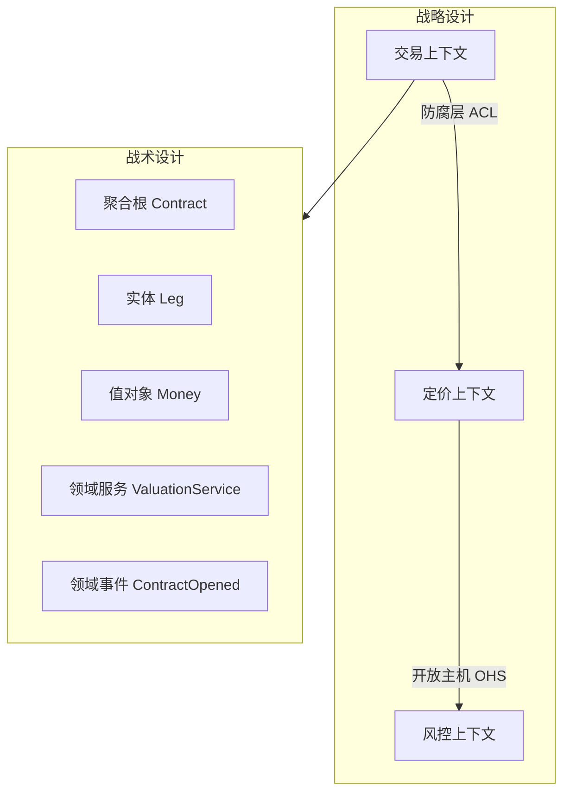
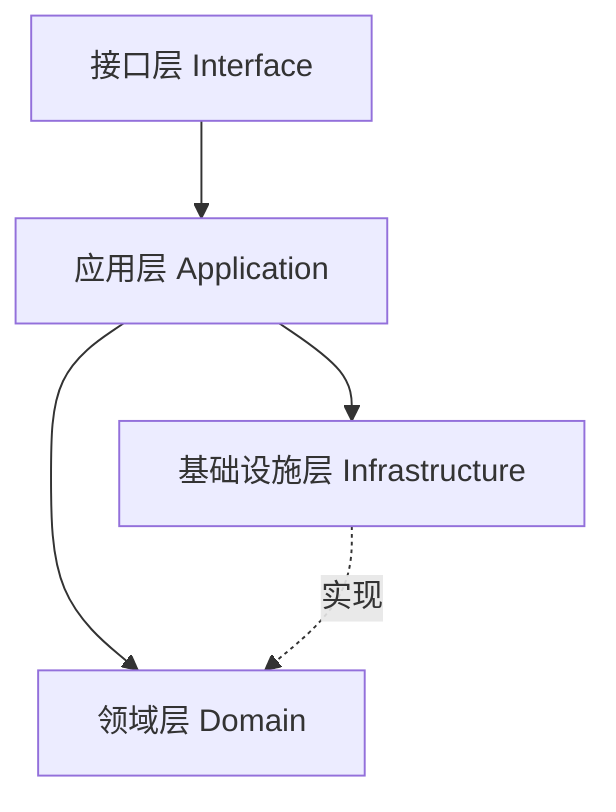

# DDD 理解与实践

## 定义

DDD（Domain-Driven Design，领域驱动设计）是一种 **以业务领域为中心** 的复杂软件建模方法。核心目标：在业务快速变化时，通过 **统一语言（Ubiquitous Language）** 和 **清晰的模型边界**，使代码结构与业务概念对齐，降低沟通成本与腐化速度。

DDD 不是「多几层包」的架构标签，而是一套 **战略设计 + 战术设计** 的组合工具。

## 战略设计 vs 战术设计

| 层次 | 关注点 | 核心概念 |
|------|--------|----------|
| 战略设计 | 系统如何切分、团队如何对齐 | 限界上下文、上下文映射、子域 |
| 战术设计 | 上下文内部如何建模 | 实体、值对象、聚合、领域服务、领域事件 |



## 复杂业务的抽象方式

### 1. 识别子域

| 子域类型 | 含义 | 投入策略 |
|----------|------|----------|
| 核心域 | 差异化竞争力 | 精建模、自研 |
| 支撑域 | 必需但非差异化 | 可适度外包或复用 |
| 通用域 | 行业通用能力 | 买现成 / SaaS |

例（期权业务）：结构定价与生命周期管理是 **核心域**；邮件通知是 **通用域**。

### 2. 限界上下文（Bounded Context）

规则：

1. 同一中文词在不同上下文 **含义可以不同**（如「客户」在 CRM 与交易上下文字段不同）。
2. 上下文是 **模型边界**，不一定是微服务边界（可一上下文一服务，也可多上下文同服务起步）。
3. 上下文间通过 **映射关系** 集成，避免一个大而全的统一模型。

常见上下文映射：

| 关系 | 含义 |
|------|------|
| 共享内核 Shared Kernel | 共享少量模型，需严格同步 |
| 防腐层 ACL | 翻译外部模型，保护内部模型纯净 |
| 开放主机 OHS | 对外暴露稳定协议 |
| 发布语言 PL | 基于文档/事件的公共语言 |

### 3. 战术建模要素

| 要素 | 定义 | 识别规则 |
|------|------|----------|
| 实体 Entity | 有唯一标识，生命周期内标识不变 | TradeId、ContractId |
| 值对象 Value Object | 无独立标识，由属性定义相等性 | Money、DateRange、ContractTerms 快照 |
| 聚合 Aggregate | 一致性边界，对外以根实体操作 | Contract 为根，Leg 通过 Contract 修改 |
| 聚合根 Aggregate Root | 聚合唯一入口，保证不变量 | Contract 状态不可绕过事件直接改 |
| 领域服务 Domain Service | 无自然归属某一实体的领域逻辑 | 跨聚合估值、保证金计算 |
| 领域事件 Domain Event | 领域中已发生的重要事实 | ContractOpened、ContractUnwound |
| 仓储 Repository | 聚合持久化抽象 | ContractRepository |
| 应用服务 Application Service | 编排用例，不含核心业务规则 | OpenContractUseCase |
| 基础设施 Infrastructure | 技术实现 | MyBatis Mapper、MQ、Redis |

### 4. 聚合设计规则

1. 聚合内 **强一致**，聚合间 **最终一致**（事件/MQ）。
2. 聚合尽量 **小**，避免大聚合导致锁竞争与加载膨胀。
3. 跨聚合引用 **只持 ID**，不持对象引用。
4. 不变量（Invariant）在聚合根内强制执行。

例（期权合约）：

```
Contract（聚合根）
  ├── remainingNotional ≤ initialNotional
  ├── status 变更必须经 LifecycleEvent
  └── Leg[]（聚合内实体）
```

详见 [领域模型与合约结构](../../期权业务/实现/领域模型与合约结构.md)。

## DDD 分层架构（典型）



| 层 | 职责 | 禁止 |
|----|------|------|
| 接口层 | Controller、DTO 转换、鉴权 | 写业务规则 |
| 应用层 | 事务边界、用例编排、发布事件 | 领域逻辑堆在 Service |
| 领域层 | 实体、值对象、领域服务、不变量 | 依赖 MyBatis/HTTP |
| 基础设施层 | DB、MQ、外部 API 实现 | 泄漏到领域层 |

## DDD 与 design pattern 的关系

| DDD 概念 | 常用模式 |
|----------|----------|
| 领域事件 | 观察者、发布订阅 |
| 聚合状态流转 | 状态模式 |
| 多类型生命周期处理 | 策略 + Factory + Handler |
| 外部系统对接 | 防腐层 = 适配器 |
| 复杂对象构建 | 建造者 |
| ContractTerms 版本 | 值对象 + 不可变快照 |

本库落地参考：

- [状态机与流程编排](../../期权业务/实现/状态机与流程编排.md)
- [生命周期事件设计](../../期权业务/实现/生命周期事件设计.md)
- [State + Machine 模式](../../模式落地实践/State%20+%20Machine或Engine%20模式落地实践.md)

## 贫血模型 vs 充血模型

| 模型 | 特征 | 问题 / 优点 |
|------|------|-------------|
| 贫血模型 | 实体只有 getter/setter，逻辑在 Service | 易沦为事务脚本，领域规则分散 |
| 充血模型 | 实体含业务行为，Service 只做编排 | 模型内聚，但需控制聚合大小 |

DDD 倾向 **充血领域模型**，但不意味着每个 getter 都要进实体；跨聚合逻辑放领域服务。

## 何时引入 DDD

| 条件 | 建议 |
|------|------|
| CRUD 为主、规则简单 | 不必强上 DDD，保持简单分层 |
| 规则多、状态多、跨模块概念易混淆 | 引入限界上下文与聚合 |
| 团队 > 1 且业务专家可参与建模 | 统一语言收益大 |
| 微服务拆分前 | 先划上下文再定服务边界 |

## 高频面试点

1. **聚合根是什么？为什么需要？** 一致性边界入口，外部只能通过根修改，保证不变量。
2. **DDD 与微服务的关系？** DDD 划边界，微服务是部署单元；应先上下文后服务，避免按技术层拆服务。
3. **领域事件与集成事件的区别？** 领域事件是域内事实；集成事件是跨上下文传输格式（可 ACL 翻译）。
4. **防腐层解决什么问题？** 外部模型污染内部模型，翻译在边界完成。

## 面试官视角

1. **复杂业务你怎么做抽象？**
   - 考察点：能否从业务语言到模型，而非直接谈表结构。
   - 参考回答：与业务对齐统一语言；划限界上下文；识别聚合根与不变量；生命周期用状态机 + 领域事件；跨上下文用事件最终一致。期权场景中 Contract 是聚合根，平仓/行权通过 LifecycleEvent 驱动而非直接改 status。

2. **应用服务和领域服务的边界？**
   - 考察点：是否把领域逻辑堆在 ApplicationService。
   - 参考回答：应用服务负责编排、事务、权限、调用仓储；领域服务承载跨实体但不属任一实体的纯领域规则；单聚合内规则进实体方法。

## 延伸问题

1. Event Sourcing 与 DDD 领域事件的关系？
2. CQRS 在什么场景值得引入？（读模型复杂、读写负载差异大）
3. 如何防止 DDD 过度设计？（从核心域开始、小聚合迭代）
