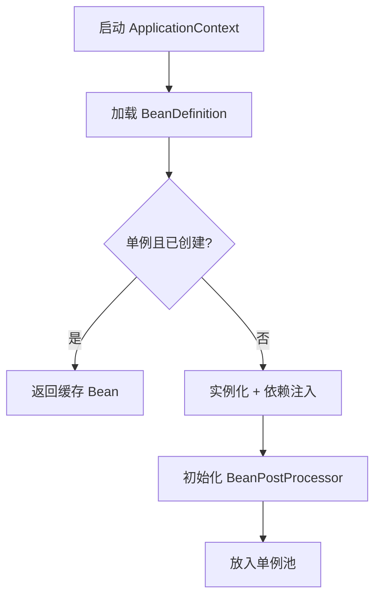
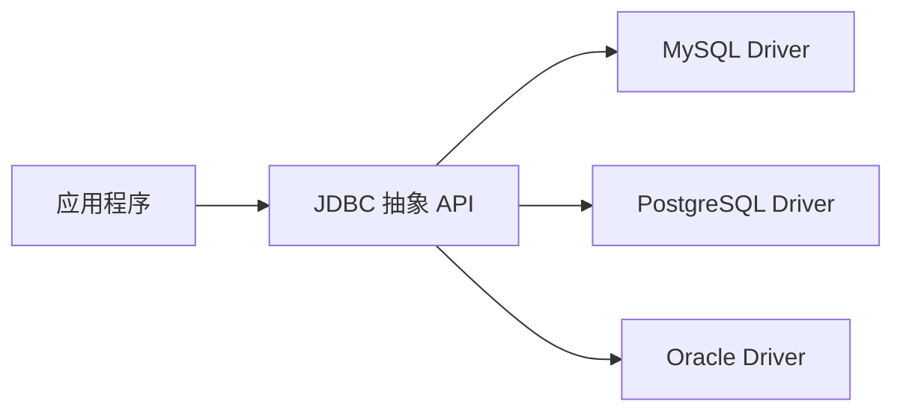
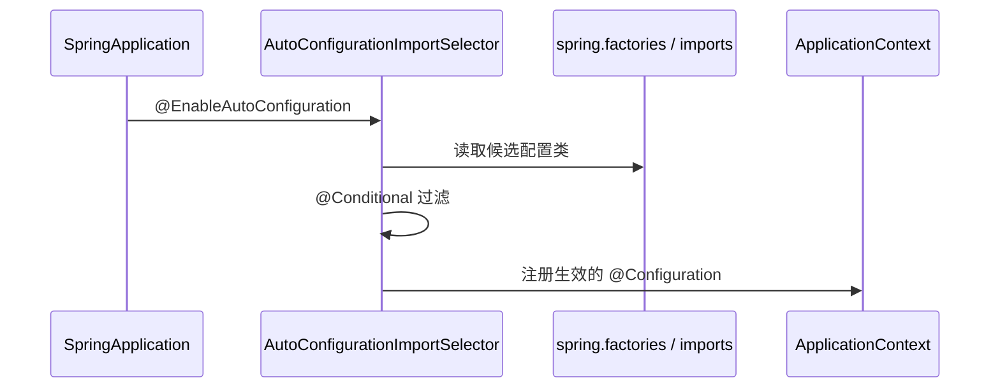

# 框架与项目应用

## 定义

主流 Java 框架并非「另一种语法」，而是 GoF 模式与 [设计原则](./设计原则.md) 的 **工程化组合**。理解框架中的模式映射，有助于读源码、做扩展和面试答「Spring 为什么这样设计」。

## Spring 与工厂模式

### 核心映射

| Spring 概念 | 对应模式 | 作用 |
|-------------|----------|------|
| `BeanFactory` / `ApplicationContext` | 抽象工厂 + 单例 | 统一管理 Bean 生命周期 |
| `@Bean` 方法 | 工厂方法 | Java Config 显式声明创建逻辑 |
| `FactoryBean` | 工厂方法 | 复杂对象创建委托给 FactoryBean |
| `@Component` + 组件扫描 | 注册表 + 工厂 | 自动发现与实例化 |

### Bean 创建流程（简化）



### 工程规则

1. **默认单例**：无状态 Service、Repository 用单例；有状态或线程不安全 Bean 用 `@Scope("prototype")`。
2. **构造器注入**：符合 DIP，依赖明确、便于单测；避免 `@Autowired` 字段注入。
3. **Factory + Handler 扩展**：`List<XxxHandler>` 注入是 Spring 对 **策略 + 开闭** 的惯用法，见 [Factory + Handler](../../模式落地实践/factory-handler-pattern.md)。

### 面试常问

- **Spring 如何解决循环依赖？** 仅单例 + 字段/setter 注入可通过三级缓存提前暴露半成品；构造器循环依赖无法解决，需重构。
- **BeanFactory 与 ApplicationContext 区别？** ApplicationContext 是 BeanFactory 子集增强，提供事件、国际化、AOP 自动注册等。

## JDBC 与桥接模式

### 结构

JDBC API（`Connection`、`Statement`）是 **抽象**，各数据库 Driver 是 **实现**，二者通过 `DriverManager` /  SPI 桥接，使应用代码不依赖 Oracle/MySQL 具体类。



### 与适配器的区别

| 维度 | JDBC 桥接 | 适配器 |
|------|-----------|--------|
| 意图 | 设计期分离抽象与实现，双维度独立扩展 | 兼容已有不匹配接口 |
| 时机 | 规范制定时即分层 | 集成第三方时包装 |

### 工程落地

1. 业务代码只依赖 `DataSource` + `JdbcTemplate`（Facade），不直接 `new` Driver。
2. 连接池（HikariCP）再封装物理连接创建，又一层 **工厂 + 单例池**。
3. MyBatis 在 JDBC 之上用 **Mapper 代理** 屏蔽 SQL 执行细节。

## Spring Boot SPI 机制

### 定义

SPI（Service Provider Interface）是 **框架定义接口、应用/第三方提供实现、容器自动发现** 的扩展机制。Spring Boot 用它实现「引入 jar 即自动配置」。

### 核心组件

| 机制 | 文件 / 注解 | 作用 |
|------|-------------|------|
| `@EnableAutoConfiguration` | 启动类 | 触发自动配置扫描 |
| `AutoConfiguration` | `@Configuration` 类 | 条件满足时注册 Bean |
| `@ConditionalOnXxx` | 条件注解 | 按 classpath、属性、Bean 是否存在决定是否生效 |
| `spring.factories`（Boot 2.x） | `META-INF/spring.factories` | 声明自动配置类全限定名 |
| `AutoConfiguration.imports`（Boot 3.x） | `META-INF/spring/...imports` | 同上，新格式 |
| Java SPI | `META-INF/services/接口全名` | JDK 标准服务发现 |

### 自动配置加载流程



### 与开闭原则的关系

1. 框架 **稳定**：`ApplicationContext` 启动流程不变。
2. 扩展 **开放**：新增 starter 只需 jar + 自动配置类，不改 Boot 核心。
3. 自定义 Starter 步骤：创建 `xxx-spring-boot-autoconfigure` → 写 `@AutoConfiguration` → 注册到 `imports` → 可选 `xxx-spring-boot-starter` 聚合依赖。

### 工程示例：条件装配

```java
@AutoConfiguration
@ConditionalOnClass(DataSource.class)
@ConditionalOnProperty(prefix = "app.cache", name = "enabled", havingValue = "true")
public class CacheAutoConfiguration {
    @Bean
    @ConditionalOnMissingBean
    public CacheManager cacheManager() { ... }
}
```

规则：`@ConditionalOnMissingBean` 允许业务方自定义实现覆盖默认 Bean。

## 其他框架模式速查

| 框架 / API | 模式 | 说明 |
|------------|------|------|
| Spring AOP | 代理（JDK 动态代理 / CGLIB） | 横切关注点 |
| Spring MVC `HandlerAdapter` | 适配器 | 统一处理多种 Controller 类型 |
| `RestTemplate` / Feign | 代理 + 外观 | 远程 HTTP 调用 |
| Servlet Filter 链 | 责任链 | 请求预处理 |
| `@EventListener` | 观察者 | 域内事件解耦 |
| MyBatis Plugin | 责任链 + 代理 | 拦截 SQL 执行 |
| SLF4J | 外观 | 日志 API 与实现分离 |

## 高频面试点

1. Spring 用了哪些设计模式？（工厂、单例、代理、模板方法、观察者、适配器）
2. `spring.factories` 与 Java SPI 的区别？（Spring 扩展由 Boot 定制加载与条件过滤；Java SPI `ServiceLoader` 较原始）
3. `@Transactional` 为何自调用失效？（绕过代理，AOP 基于代理模式）
4. 如何写一个 Spring Boot Starter？（autoconfigure + imports + starter pom）

## 与本库项目的关系

| 项目实践 | 框架模式 |
|----------|----------|
| [账户缓存架构优化](../../resume-projects/账户缓存架构优化项目.md) | 单例 Bean、模板方法式批量查询 |
| [CapitalFlowService 重构](../../重构案例/CapitalFlowService%20重构案例.md) | Factory + Handler、策略 |
| [期权状态机](../../期权业务/实现/状态机与流程编排.md) | State + Spring 组件 |

## 延伸问题

1. Spring 三级缓存具体存什么？与循环依赖的关系？
2. CGLIB 代理与 JDK 动态代理的选型边界？
