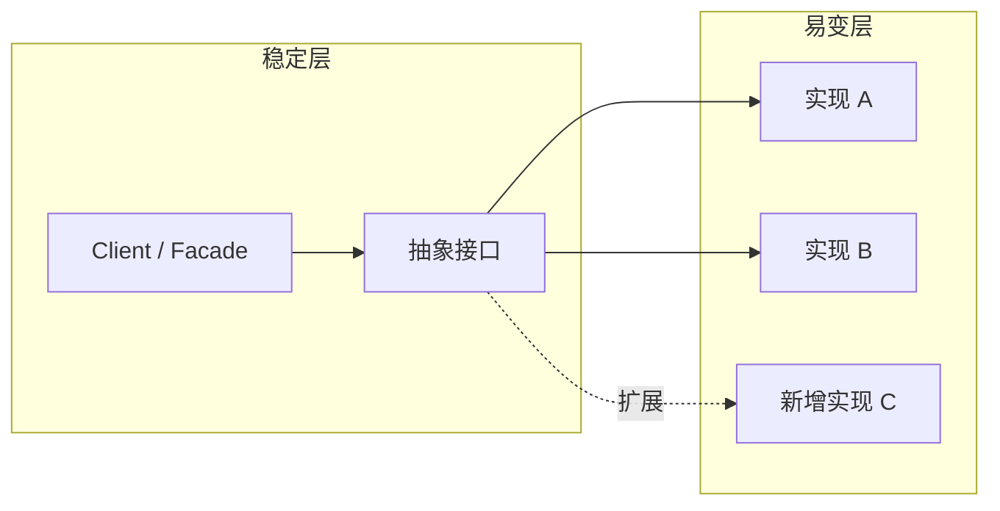

# 设计原则

## 定义

设计原则是比具体模式更底层的 **约束与判断标准**，用于在需求变化时决定类、模块、服务边界如何划分。核心目标：**变化与稳定的隔离** — 将易变部分封装，使稳定接口尽量不受影响。

## SOLID 五大原则

| 原则 | 英文 | 含义 | 违反时的症状 | 修复手段 |
|------|------|------|--------------|----------|
| 单一职责 SRP | Single Responsibility | 一个类/模块只有一个引起变化的原因 | 类上千行、改 A 功能破坏 B 功能 | 按职责拆类/拆模块 |
| 开闭原则 OCP | Open/Closed | 对扩展开放，对修改关闭 | 每加一种类型改一大段 if-else | 策略、工厂、插件、SPI |
| 里氏替换 LSP | Liskov Substitution | 子类可替换父类且不破坏语义 | 子类抛新异常、收紧前置条件 | 组合优于继承、接口契约测试 |
| 接口隔离 ISP | Interface Segregation | 客户端不依赖不需要的方法 | 实现类大量空方法 / 抛 Unsupported | 拆小接口、Role Interface |
| 依赖倒置 DIP | Dependency Inversion | 依赖抽象，不依赖具体 | 高层直接 `new` 具体实现 | 构造器注入、接口 + DI 容器 |

### 开闭原则 — 变化与稳定的隔离



规则：

1. 客户端代码只依赖 **接口或抽象类**。
2. 新增行为通过 **新增实现类** 完成，不修改客户端。
3. Spring `@Autowired List<Handler>` 自动收集新 Handler 是 OCP 的典型工程实现。

### 依赖倒置 — 与 Spring 的关系

```java
// 违反 DIP：高层依赖具体类
public class OrderService {
    private AliPayClient payClient = new AliPayClient();
}

// 符合 DIP：依赖 PaymentProvider 抽象
public class OrderService {
    private final PaymentProvider paymentProvider;
    public OrderService(PaymentProvider paymentProvider) {
        this.paymentProvider = paymentProvider;
    }
}
```

## 其他常用原则（常称「七大」扩展）

| 原则 | 含义 | 实践 |
|------|------|------|
| 迪米特法则 LoD | 只与直接朋友通信，减少耦合 | 不链式调用 `a.getB().getC().do()` 跨层 |
| 合成复用原则 CRP | **组合优于继承** | 用 `@Delegate`、持有接口而非 extends |
| 面向接口编程 | 声明类型用接口/抽象类 | 变量类型 `List` 而非 `ArrayList` |
| 高内聚低耦合 | 模块内部紧密、模块间松散 | 领域模块边界清晰 |

### 组合优于继承

| 维度 | 继承 extends | 组合 holds-a |
|------|--------------|--------------|
| 耦合 | 与父类实现强绑定 | 仅依赖接口 |
| 扩展 | 单继承限制 | 可叠加多个行为 |
| 测试 | 需构造父类上下文 | 可 Mock 依赖 |
| 典型 | 模板方法（谨慎使用） | 策略注入、Decorator |

反例：为复用 10 行代码 extends 整个 Service 基类，导致子类承担无关生命周期逻辑。

正例：CashFlow 处理用 `List<TradeCashFlowHandler>` 组合多种 Handler，见 [Factory + Handler 落地](../../模式落地实践/factory-handler-pattern.md)。

## 原则 vs 模式

| 层次 | 作用 | 示例 |
|------|------|------|
| 原则 | 判断「为什么这样拆」 | DIP → 面向接口 + DI |
| 模式 | 判断「用什么结构落地」 | 策略模式实现 OCP |
| 反模式 | 应避免的写法 | 上帝类、贫血模型、过度抽象 |

## 高频面试点

1. **SRP 和「一个类只有一个方法」的区别？** SRP 指 **变化原因** 单一，不是方法数量单一。
2. **OCP 是否意味着永远不能改旧代码？** 不是。修复 Bug、提升内聚的修改允许；指 **新增需求** 时优先扩展而非改调用方。
3. **里氏替换经典反例？** 正方形继承矩形，修改宽时破坏高宽独立语义。
4. **ISP 在微服务中的体现？** 拆分臃肿 REST API，按客户端角色提供专用 BFF，避免前端依赖无用字段。

## 面试官视角

1. **你如何在项目中体现开闭原则？**
   - 考察点：能否举出扩展点设计，而非空谈概念。
   - 参考回答：交易现金流按 eventType × cashFlowType 分支增多时，将每种处理拆为独立 Handler 并注册到 Spring 容器，新增类型只加 Handler 不改 Service 主流程。

2. **组合优于继承在什么情况下仍会用继承？**
   - 考察点：是否理解模板方法、框架钩子类的合理边界。
   - 参考回答：框架提供扩展点时（如 `AbstractHandler` 统一日志与异常），继承用于 **复用固定骨架**；业务差异部分仍用组合的策略对象。

## 延伸问题

1. 贫血模型 vs 充血模型与 SRP 的关系？
2. DDD 聚合根设计如何体现高内聚？
